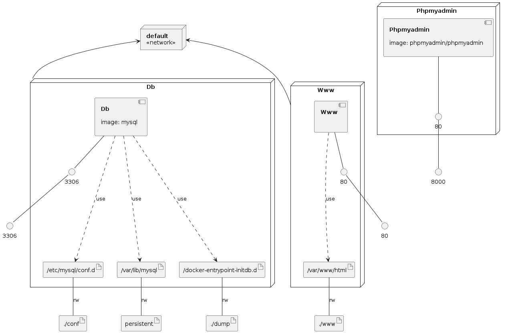
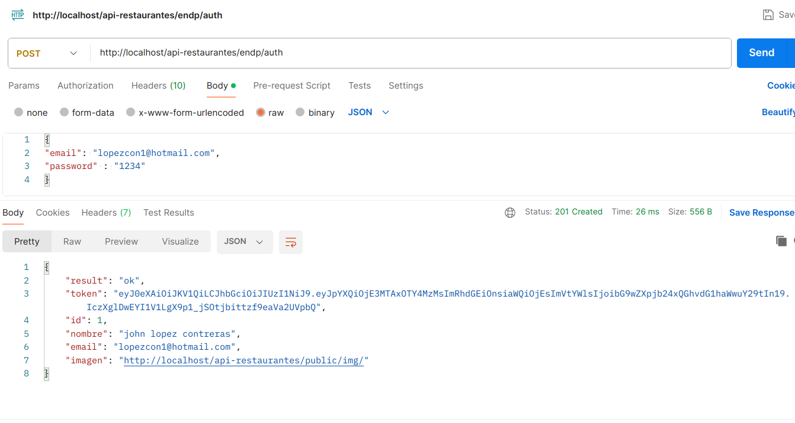
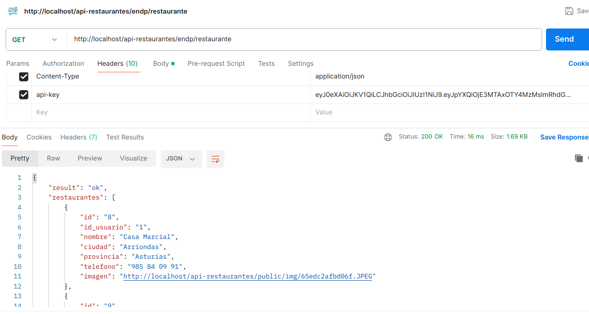
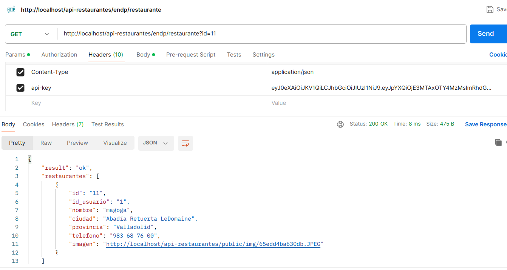
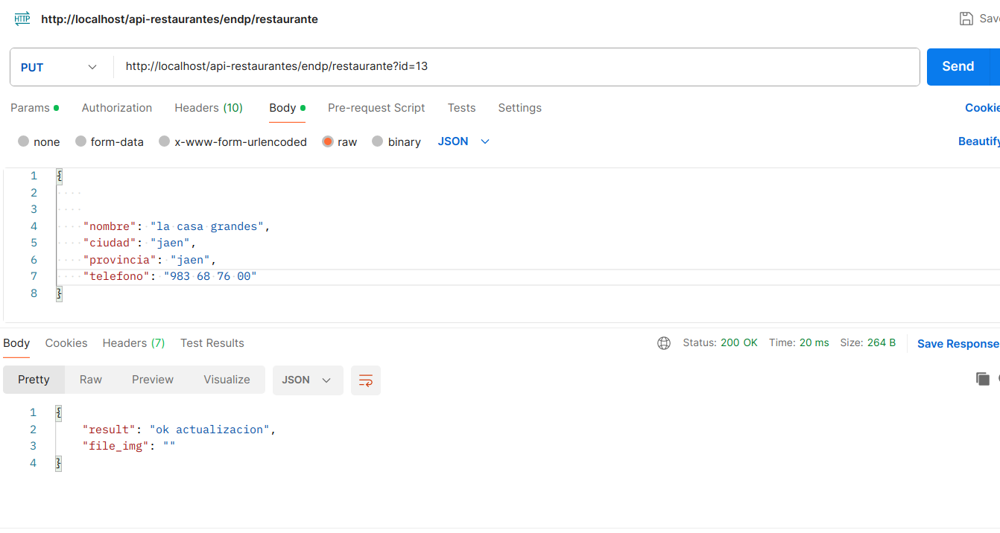
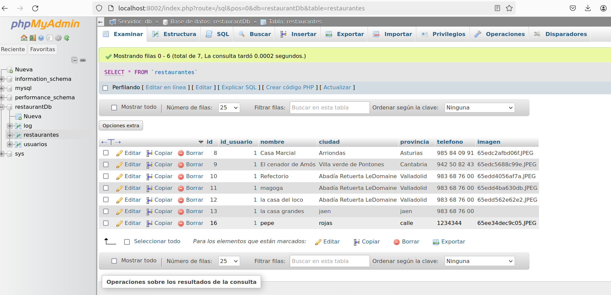
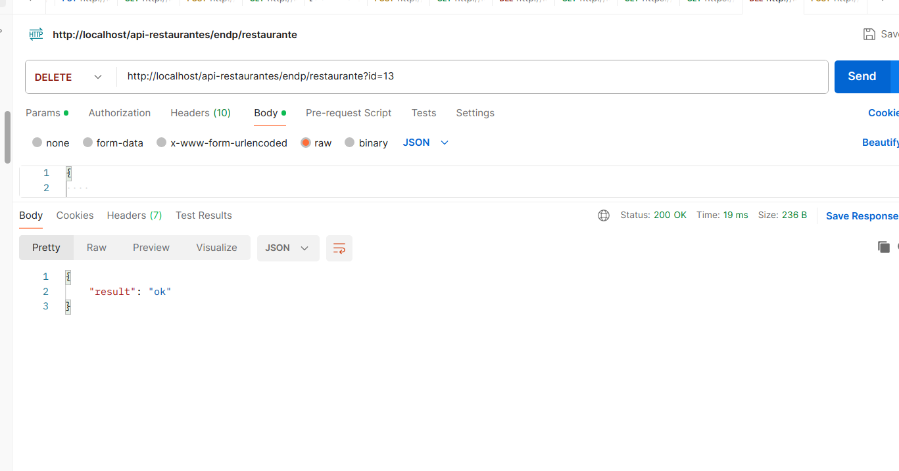
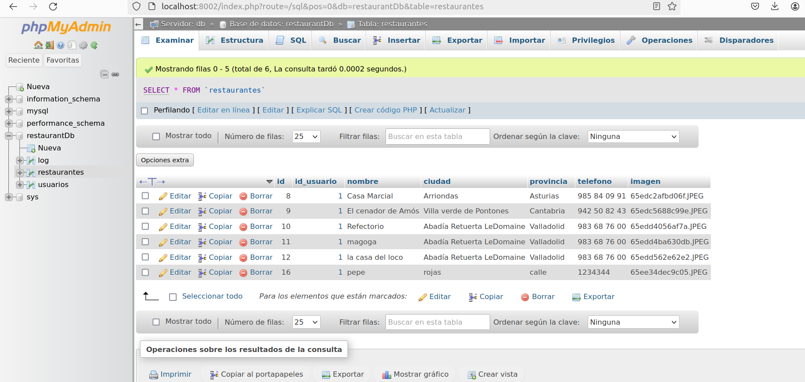
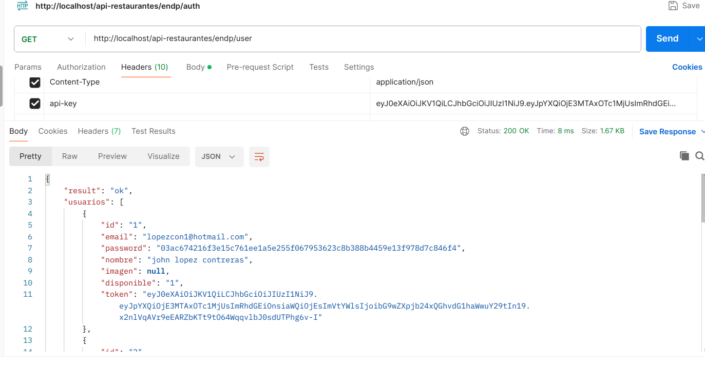
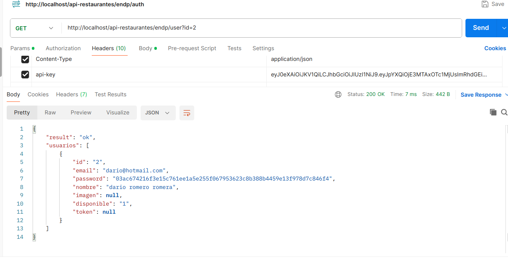

# Watch the video 👇

[](https://youtu.be/v-r_12oezds)

## docker-lamp

Docker with Apache, MySQL 8.0, PHPMyAdmin and PHP.

## Infrastructure model



## Documentación  `Api-Restaurante`

## Creacion de la tabla `usuarios:`

```code
   
CREATE TABLE `usuarios` (
  `id` int(4) PRIMARY KEY AUTO_INCREMENT,
  `email` varchar(150) NOT NULL,
  `password` varchar(240) NOT NULL,
  `nombre` varchar(200) NOT NULL,
  `imagen` varchar(200) DEFAULT NULL,
  `disponible` tinyint(1) NOT NULL,
  `token` varchar(255) DEFAULT NULL
) ENGINE=InnoDB DEFAULT CHARSET=utf8mb4 COMMENT='tabla de usuarios';

```


## Creacion de la tabla `restaurantes:`

```code
CREATE TABLE `restaurantes` (
  `id` int(7) AUTO_INCREMENT PRIMARY KEY,
  `id_usuario` int(11) NOT NULL,
  `nombre` varchar(100) NOT NULL,
  `ciudad` varchar(100) NOT NULL,
  `provincia` varchar(100) NOT NULL,
  `telefono` varchar(250) NOT NULL,
  `imagen` varchar(100) DEFAULT NULL
) ENGINE=InnoDB DEFAULT CHARSET=utf8mb4;
```

## Creamos la relación entre el usuario y restaurante

```code
    ALTER TABLE `restaurantes`
    ADD CONSTRAINT FK_id_usuario FOREIGN KEY (id_usuario)
    REFERENCES `usuarios` (id);
```

# Creamos el el docker-compose

```code
version: '3'version: "3.1"
services:
    db:
        image: mysql    -Utiliza la imagen oficial de MySQL desde Docker Hub
        ports: 
            - "${MYSQL_PORT}:3306"   -Mapea el puerto del host al puerto del contenedor
        command: --default-authentication-plugin=mysql_native_password
        environment:
            MYSQL_DATABASE: ${MYSQL_DATABASE}   -Nombre de la base de datos
            MYSQL_PASSWORD: ${MYSQL_PASSWORD}   -Contraseña de la base de datos
            MYSQL_ROOT_PASSWORD: ${MYSQL_ROOT_PASSWORD}  -Contraseña del usuario 
        volumes:
            - ./dump:/docker-entrypoint-initdb.d  - Monta el directorio 'dump' en la inicialización de la base de datos
            - ./conf:/etc/mysql/conf.d  -Monta el directorio 'conf' para configuraciones adicionales
            - persistent:/var/lib/mysql  -Monta el volumen 'persistent' para datos persistentes
        networks:
            - default  -Usa la red predeterminada
    www:
        build: .
        ports: 
            - "{PORT}:80"
        volumes:
            - ./www:/var/www/html
        links:
            - db
        networks:
            - default
    phpmyadmin:
        image: phpmyadmin/phpmyadmin
        links: 
            - db:db
        ports:
            - ${PHPMYADMIN_PORT}:80
        environment:
            MYSQL_USER: ${MYSQL_USER}
            MYSQL_PASSWORD: ${MYSQL_PASSWORD}
            MYSQL_ROOT_PASSWORD: ${MYSQL_ROOT_PASSWORD}
volumes:
    persistent:

```

# Imagenes de consultas a la api con posmant












